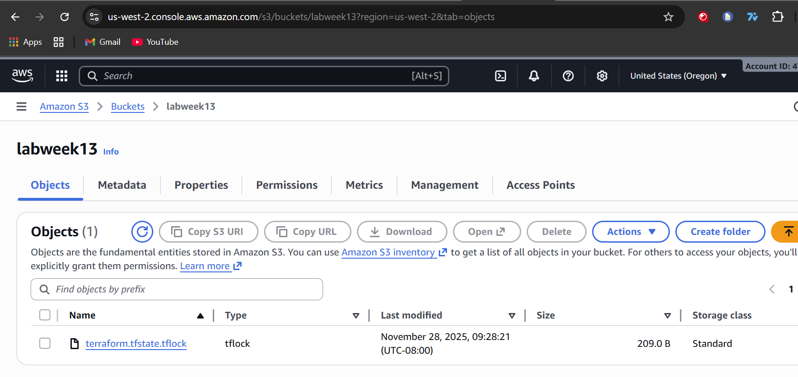

# ACIT4640 - Lab Week 13: Terraform State

## Questions

### When is the state file created?

The state file is created after terraform apply successfully completes.

### When is the lock file present?

The lock file is present during terraform apply and terraform destroy as long as both processes are running.

### Is the lock file always in the bucket after it is created?

No, the lock file is not always in the bucket after it is created. The lock file is there while the processes are running and is removed once either terraform apply or terraform destroy are completed.

## Screenshots

>[!NOTE] I was having the same issues as others in class. So below is a screenshot of the state and lock files separately, however, I also did terraform destroy and then did terraform apply again to get both the lock and state file visible together.

### Just the state file

### Just the lock file

### Both state and lock file

